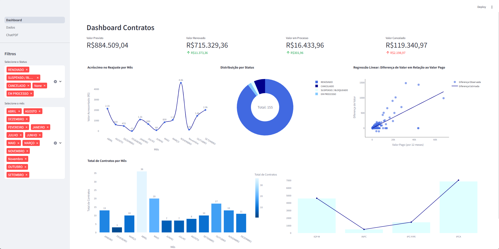

# Dashboard Contratos

Este projeto é um dashboard para gerenciar contratos. Ele permite visualizar, adicionar, editar e excluir contratos de forma eficiente.

## Funcionalidades

- Visualização de contratos
- Adição de novos contratos
- Edição de contratos existentes
- Exclusão de contratos

## Imagens

.png)

## Tecnologias Utilizadas

- Pandas
- Plotly
- Streamlit
